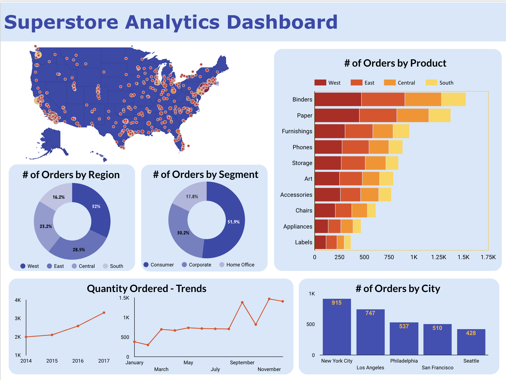

# Superstore Analytics Dashboard

## Overview
The **Superstore Analytics Dashboard** is a comprehensive data visualization project designed to analyze and present sales trends, order distributions, and customer segment performance for a retail superstore. This dashboard provides insights into product popularity, regional sales performance, and temporal trends, enabling data-driven decision-making for business growth.

## Features
- **Product Analysis**: Visual representation of the number of orders by product category, highlighting top-selling items.
- **Regional Insights**: Breakdown of orders by geographic regions (West, East, Central, South) to identify key markets.
- **Customer Segmentation**: Analysis of sales performance across different customer segments: Consumer, Corporate, and Home Office.
- **Temporal Trends**: Visualization of order quantities over multiple years (2014-2017) to identify growth patterns and seasonal trends.
- **City-Specific Data**: Detailed order statistics for major cities, showcasing urban market dynamics.

## Used Looker Studio for interactive dashboard. [View Dashboard](https://lookerstudio.google.com/embed/reporting/b1af5160-aa10-4866-a356-c575a7283050/page/l4XCE)

### Key Insights

1. **Q: What are the top-selling product categories based on the number of orders?**
   - **A:** The top-selling product categories include Binders, Paper, and Furnishings, which show significant order quantities compared to other categories.

2. **Q: How do order quantities vary by region?**
   - **A:** The West region has the highest percentage of orders at 32%, followed by the South at 28.5%, indicating that these regions are key markets for the superstore.

3. **Q: Which customer segment generates the most orders?**
   - **A:** The Corporate segment accounts for 51.9% of total orders, making it the largest customer segment, followed by the Consumer and Home Office segments.

4. **Q: What are the order trends over the years from 2014 to 2017?**
   - **A:** The data shows an upward trend in order quantities over the years, indicating consistent growth in sales and customer engagement.

5. **Q: Which cities have the highest number of orders?**
   - **A:** New York City leads with 915 orders, followed by Los Angeles with 747 orders, highlighting the importance of urban markets in driving sales.

6. **Q: How does the order distribution look across different product categories?**
   - **A:** The dashboard visualizes the order distribution, showing that products like Phones and Storage also have substantial order quantities, while categories like Art and Accessories have lower sales.

7. **Q: Are there any seasonal trends observed in the order quantities?**
   - **A:** The dashboard can be used to analyze seasonal trends by comparing monthly or quarterly order quantities, helping to identify peak sales periods.

8. **Q: What percentage of orders come from each region?**
   - **A:** The dashboard provides a breakdown of orders by region, with the West at 32%, East at 16.2%, Central at 23.2%, and South at 28.5%.
